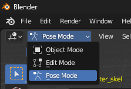
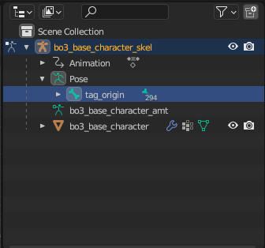
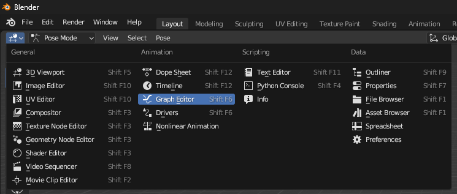

# Custom Traversal Animations
How I created custom traversal animations for heights that were not provided.

## Prerequisites
This is how I personally made my animations. There may be other solutions for other software, or maybe even something much simpler I missed
- [Blender 3.6](https://www.blender.org/download/releases/3-6/)
	- I found that importing xanims in Blender 4.0 or above caused errors with the plugin
- [pv_blender_cod](https://github.com/prov3ntus/pv_blender_cod)

## Importing Existing XAnim
1. Open Blender 3.6 and select `File > Import > Import XModel`
2. Navigate to `Call of Duty Black Ops III\model_export\base_character` and open `bo3_base_character.XMODEL_BIN`
3. Select `File > Import > Import XAnim`
4. Navigate to your `Call of Duty Black Ops III\xanim_export\ai\zombie` and open the closest XAnim to the one you want to create

## Modifying Existing XAnim
1. Select `Pose Mode` and then select the armature's `tag_origin`

2. Open the `Graph Editor`
Do this in a new window if you know how. Not necessary but helpful for seeing what you're doing

3. Double click the `Z Location (tag_origin)` to highlight the vertical height graph
**You may want to play around with the graph more than outlined here. This is intended to be a very simple guide to get something working**
4. Press `S` (scale), then `Y` (vertical), and type the amount to scale by.
	- To find the amount to scale by, take your desired height and divide it by the height of the existing XAnim. For example if I want a 200 high jump and I imported `ai_zombie_base_jump_up_160`, I would do `200 / 160` which is `1.25`
5. You'll notice the start of the line move up from 0. To fix this select any of the keyframes that were originally at 0 and copy the value of the `Active Keyframe`
	- In my 200 from 160 example, my value is `-0.508683 m`
6. Press `G` (move), then `Y` (vertical), and type the inverse of the value of the active keyframe
	- In my example this would be `0.508683`

## Exporting Modified XAnim
11. Select your entire armature and press `A` to select all of the bones
12. Select `File > Export > Export XAnim`
13. Ensure `Binary (Bin)` is selected, `Use Notetrack` is **unchecked**, and `Export All Actions` says `(1 actions)`
14. Export to `Call of Duty Black Ops III\xanim_export\ai\zombie` and name it the same as the one you imported, but with the height number changed
	- In my example this would be `ai_zombie_base_jump_up_200.xanim_bin`
15. Open APE, and copy the XAnim into your GDT and name it to match the file name
16. Select your new `Anim File`
17. Use it in your node_negotiations or wherever else you'd like!