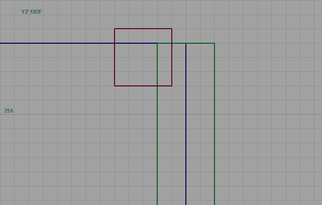
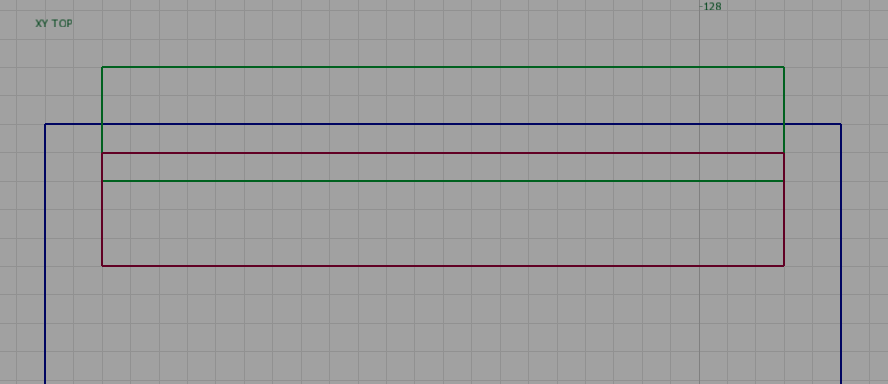

# Fix Falling Off Ladders
If you're unable to climb up to the top of ladders without just falling back down to the bottom, like [seen here](https://gyazo.com/1c12f0881744761d31d3bcc2d4e377f8), here's how you can fix it.
## Image References
In the images below, blue is your clip / ground you're trying to climb over, green is the ladder brush, and red is a wall_climb brush

## Description
You want your ladder clip to end level with the floor, and clip into the floor some. Then, add a wall_climb brush 1 unit above the floor, and clipping 1 unit into the ladder, aproximately 4 units tall and 4 units wide.
